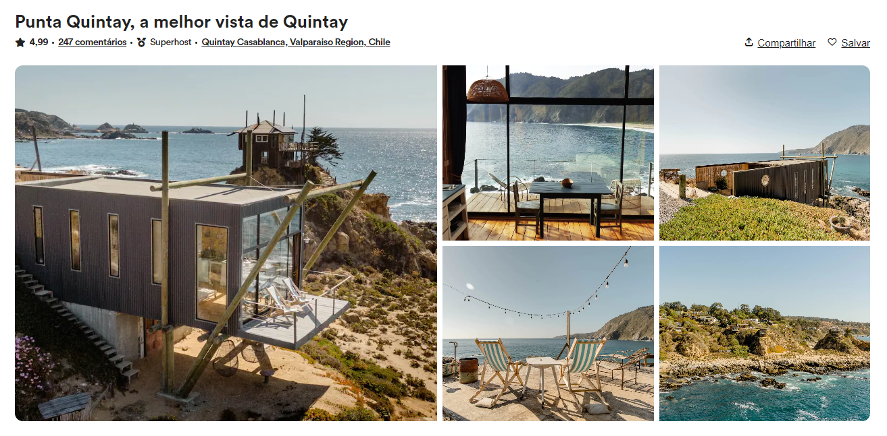

<h1 align="center">
  Layout do Airbnb
</h1>

## 📷 Deploy

<h3>LINK: https://layout-airbnb.vercel.app/</h3>

## 💻 Projeto

Neste projeto realizado em aula, pratiquei o uso de HTML e CSS, utilizando algumas técnicas para criação de interface com o uso de display grid.

## 🚀 Tecnologias

- HTML
- CSS

## 📝 Aprendizados

- [x] Uso da propriedade **grid** do `display`
- [x] Uso do seletor `not` do css
- [x] Uso do seletor `has` do css
- [x] Animação com a propriedade `scale` do css
